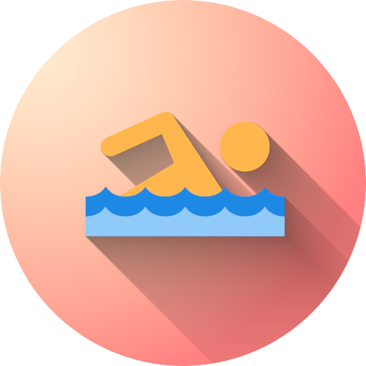

[![Contributors][contributors-shield]][contributors-url]
[![MIT License][license-shield]][license-url]
[![LinkedIn][linkedin-shield]][linkedin-url]

<!-- PROJECT LOGO -->
<br />
<p align="center">
  
  <h3 align="center">swim-net</h3>

  <p align="center">
    A machine learning approach to predicting the value of an athlete on the collegiate level.
    <br />
    <a href="https://github.com/Scornz/swim-net/archive/refs/heads/main.zip"><strong>Download source</strong></a>
    <br />
  </p>
</p>

<!-- ABOUT THE PROJECT -->

## About The Project

A project made in only 36 hours for [HackPrinceton](https://www.hackprinceton.com/). More information on how and why this was made is posted on [Devpost](https://devpost.com/software/swim-net).

<!--Using times and performance from highschool, the aim is to be able to accurately and efficiently predict an athlete's
performance in collegiate athletics.-->

### Built With

-   [VSCode](https://code.visualstudio.com/)
-   [TensorFlow](https://www.tensorflow.org/)

<!-- GETTING STARTED -->

## Getting Started

To get a local copy up and running follow these simple steps.

### Prerequisites

In order to build and run the above code, the following are required:

-   [Python 3.9](https://www.python.org/downloads/release/python-390/)
-   [ChromeDriver](https://chromedriver.chromium.org/) (only for web scraping data)

### Installation

1. Clone the repo
    ```sh
    git clone https://github.com/Scornz/swim-net.git
    ```
2. Navigate to local repo with cd
3. Install pip packages (venv preferred)
    ```sh
    pip install -r requirements.txt
    ```

<!-- LICENSE -->

## License

Distributed under the MIT License. See `LICENSE` for more information.

<!-- CONTACT -->

## Contact

-   Michael Scornavacca - [mas23@princeton.edu](mailto:mas23@princeton.edu?subject=[GitHub]%20Source%20swim-net%20)
-   Xander Gardner - [avg3@princeton.edu](mailto:avg3@princeton.edu?subject=[GitHub]%20Source%20swim-net%20)
-   Max Kreidl - [mkreidl@princeton.edu](mailto:mkreidl@princeton.edu?subject=[GitHub]%20Source%20swim-net%20)

Project Link - [https://github.com/Scornz/swim-net](https://github.com/Scornz/swim-net)

<!-- ACKNOWLEDGEMENTS -->

## Acknowledgements

-   Thank you [HackPrinceton](https://www.hackprinceton.com/) for organizing such a wonderful event.

<!-- MARKDOWN LINKS & IMAGES -->
<!-- https://www.markdownguide.org/basic-syntax/#reference-style-links -->

[contributors-shield]: https://img.shields.io/github/contributors/Scornz/swim-net.svg?style=for-the-badge
[contributors-url]: https://github.com/Scornz/swim-net/graphs/contributors
[license-shield]: https://img.shields.io/github/license/Scornz/swim-net.svg?style=for-the-badge
[license-url]: https://github.com/Scornz/swim-net/blob/main/LICENSE
[linkedin-shield]: https://img.shields.io/badge/-LinkedIn-black.svg?style=for-the-badge&logo=linkedin&colorB=555
[linkedin-url]: https://www.linkedin.com/in/mscornavacca/
